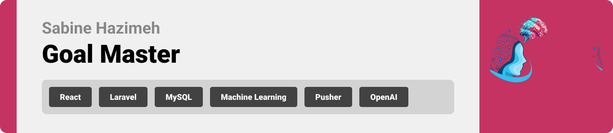

<br><br>

<!-- project philosophy -->


> A web app designed to help users set and achieve their personal goals. The platform combines goal setting, personalized planning, emotional tracking, and consultant interactions to offer a holistic approach to personal development.
>
> GoalMaster empowers users to take control of their personal growth by integrating goal setting with emotional well-being.

### User Stories

- As a user, I want to specify my goals, such as learning new skills, or financial management and the app should help me in achieving it.
- As a user, I want to connect with consultants for personalized advice and guidance.
- As a user, I want to express my emotions using facial expression recognition technology, so that my emotions are recorded.

### Admin Stories

- As an admin, I want to regularly review and monitor the sentiment data.
- As an admin, I want to add a new consultant.
- As an admin, I want to update consultant's information.

### Consultant Stories

- As a consultant, I want to chat with users to provide them with advice and guidance.

<br><br>

<!-- Tech stack -->


### Goal Master is built using the following technologies:

- The frontend is built using [React](https://legacy.reactjs.org/docs/getting-started.html), providing a dynamic and responsive user experience. React allows the app to render efficiently and scale across devices.
- [Laravel](https://laravel.com/docs/11.x/) serves as the backend framework, handling API requests, authentication, and server-side logic. It ensures the application is secure, scalable, and maintainable.
- A relational database [MySQL](https://dev.mysql.com/doc/) is used to store structured data. MySQL's efficient querying and indexing ensure the app performs well with large datasets.
- ML models are integrated to predict both health and education goals. The models analyze user inputs (such as health metrics or learning preferences) and suggest personalized recommendations.
- [OpenAI](https://platform.openai.com/docs/introduction) is used to predict financial goals. Based on user inputs like income, savings, and target date, the system generates savings plans to help users meet their financial objectives.
- [Pusher](https://pusher.com/docs/) is used to implement real-time messaging, enabling live chat functionality between users. The system supports instantaneous communication for a seamless user experience.
- [face-api.js](https://github.com/justadudewhohacks/face-api.js) JavaScript library for face detection and emotion recognition.

<br><br>

<!-- UI UX -->


> We designed Goal Master by creating detailed wireframes and mockups to visualize the structure and user flow. Throughout the design process, we focused on ensuring easy navigation and an intuitive user experience. After several iterations, incorporating feedback and improvements, we arrived at the final design that offers seamless interaction and effortless goal management for users.

Our goal was to craft a clean, functional interface that helps users focus on achieving their goals without unnecessary distractions.

- Project Figma design [figma](https://www.figma.com/design/1KpW6Me6gTjkifuRnBAuV9/Final-Project?node-id=0-1&node-type=CANVAS&t=vPxHLN63RMYazSpM-0)

### Mockups

| Home screen                             | About Us Screen                           | 
| --------------------------------------- | ------------------------------------- | 
|  |  |  |

<br><br>

<!-- Database Design -->


### Architecting Data Excellence: Innovative Database Design Strategies:

- 

<br><br>

<!-- Implementation -->


### User Screens (Web)

| Login screen                            | Profile screen                       | 
| --------------------------------------- | ------------------------------------- | 
|  |  |  |
| Live Chat                             | Education Goal                           |                        |
|  |  |
| Registration                             | Journals                            | 
|  |  |
| Profile                             | 
|  | 

<br><br>

<!-- Prompt Engineering -->


### Mastering Personalized Learning: Harnessing Machine Learning for Tailored Course and Exercise Recommendations

- This project utilizes machine learning techniques to personalize learning experiences by recommending courses that align with the user's educational goals and unique conditions. By analyzing the user’s health status, the system also predicts and suggests appropriate exercises. This approach enables precise and efficient recommendations, optimizing both the user’s learning progress and physical well-being.

|  |
<br><br>

<!-- AWS Deployment -->


### Efficient Full-Stack Deployment: Unleashing Potential with Cloud Hosting

- This project utilizes cloud hosting solutions to deploy both the Laravel backend and the database infrastructure. By focusing on scalability, reliability, and seamless integration, we ensure that the application performs optimally while managing data efficiently. This setup supports diverse use cases, ensuring robust, real-time interactions and services, powered by a reliable backend and database combination.

|  |

<br><br>

<!-- Unit Testing -->


### Accuracy in Development: Leveraging Unit Testing's Power:

- Precise unit testing techniques are applied in this project to guarantee the quality and dependability of code components. We ensure a solid foundation by carefully examining each software unit, spotting and fixing any problems early on in the development cycle.
|  |

<br><br>

<!-- How to run -->


> To set up Goal Master locally, follow these steps:

### Prerequisites


- npm
  ```sh
  npm install npm@latest -g
  ```
- npm
  ```sh
  php -r "copy('https://getcomposer.org/installer', 'composer-setup.php');"
  php composer-setup.php
  php -r "unlink('composer-setup.php');"
  ```
- you can download PHP from [here](https://www.php.net/downloads)
- you can download MySQL from [here](https://dev.mysql.com/downloads/installer/)


### Installation

Clone the repo

```sh
git clone https://github.com/sabine-hazimeh/goal-master
```

For Frontend:

1. Install NPM packages
   ```sh
   npm install
   ```
2. Create an .env file:
   ```js
   REACT_APP_OPENAI_API_KEY = "your-OpenAI-key-here"
   REACT_APP_PUSHER_KEY =acef436b4b534dafb513
   REACT_APP_PUSHER_CLUSTER=eu
   ```
3. Start the React development server:
   ```sh
   npm start
   ```
   For Backend:
4. Backend is already hosted:  
   The Laravel backend is already hosted and available [here](http://ec2-13-38-78-41.eu-west-3.compute.amazonaws.com)

Now, you should be able to run Goal Master and explore its features.
